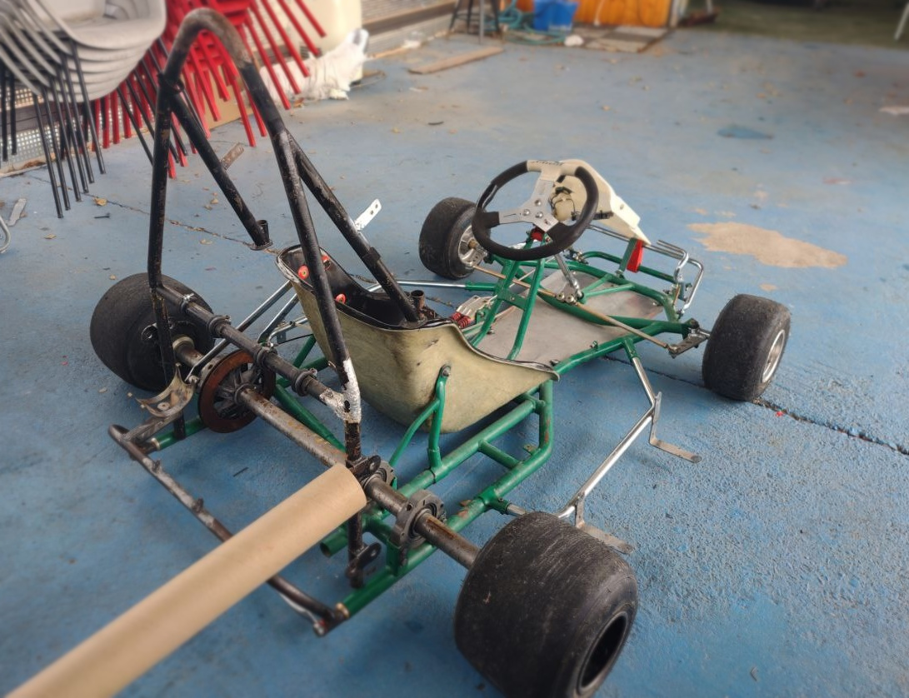
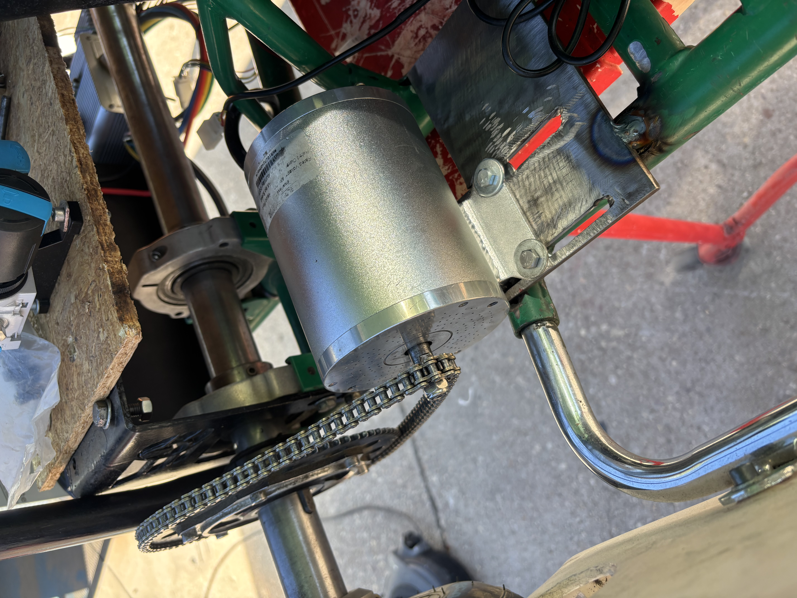
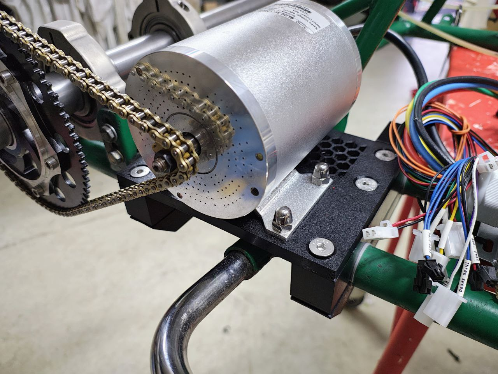
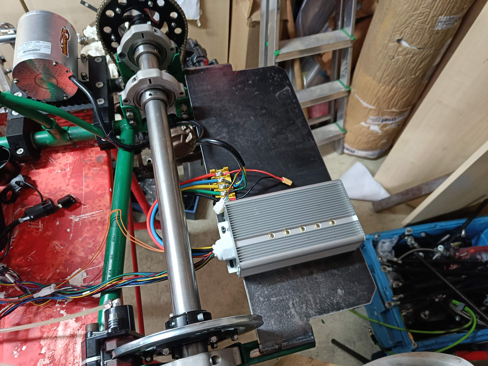
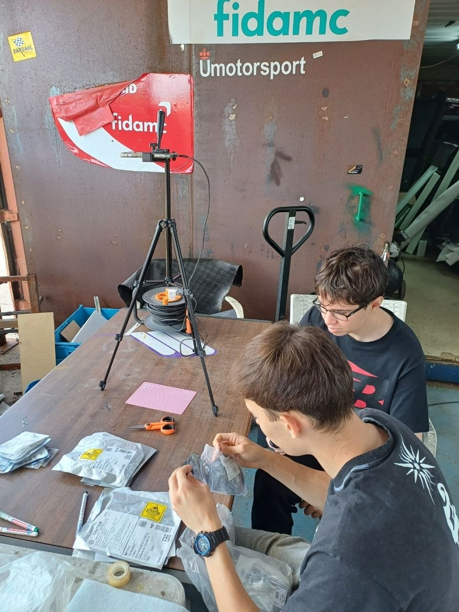
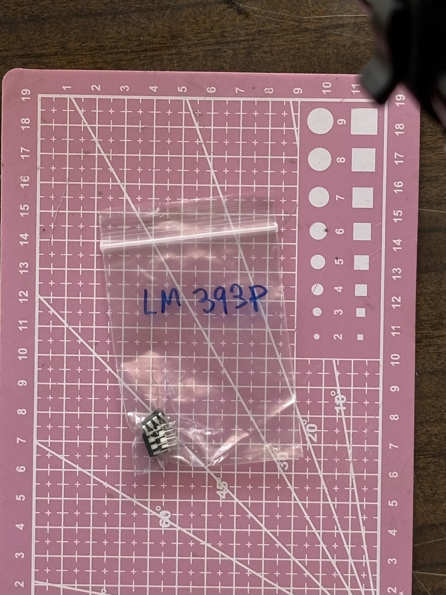
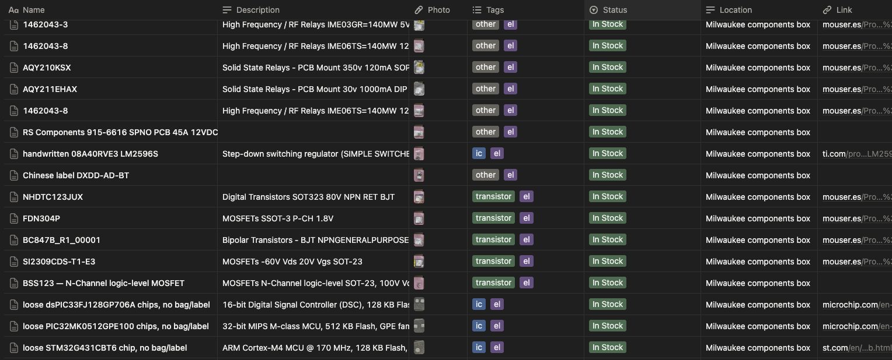

# Build Journey

Posts documenting the build of a competition kart turned autonomous vehicle. Roughly one a week on Wednesdays. New posts append at the bottom — read straight through.

[Follow on LinkedIn :fontawesome-brands-linkedin:](https://www.linkedin.com/in/rubenayla/){ .md-button }

**Jump to:** [Intro](#intro) · [Motor](#motor) · [AI Inventory](#inventory-ai)

---

## Turning a kart into a driverless racing car { #intro }

*2026-04-22 · [Original on LinkedIn →](https://www.linkedin.com/posts/rubenayla_formulastudent-driverless-umotorsport-activity-7452662533024395266-dB_m)*

We're turning a kart into a driverless racing car.

{ loading=lazy }

Huge thanks to Henakart. They gave us the whole kart, minus the engine. The rest is on us: the full autonomous stack. I'm on Ü Motorsport Driverless, the URJC student team in Madrid.

I'll post the build from day one, one piece every Wednesday, until the kart's lapping with no one in the seat.

Three stages:

1. Make it electric, so it moves under its own power.
2. Make it remote-controlled, and safe.
3. Make it driverless, so it drives itself around a cone track.

Coming up: motor → battery → braking → steering → compute → testing.

Everything's going into the [kart docs](https://um-driverless.github.io/kart_docs/) so anyone can build it themselves.

---

## Mounting the motor, and why the first bracket failed { #motor }

*2026-04-29 · [Original on LinkedIn →](https://www.linkedin.com/feed/update/urn:li:activity:7455251314227429377/)*

For our kart, the first step is to attach the motor. We kept it simple: a 48V 2000W BLDC kit, which included the controller, throttle sensor, and wiring. Our engineering goes into the battery, the safety system, and the autonomy stack.

{ loading=lazy }

Mounting it to a Tony Kart frame was a different job.

The first bracket was PLA, printed on a Bambu Lab. It bolted to the kart's tube frame and held the motor leveled with the rear axle. The bolt holes let us slide the motor to set chain tension. The kart ran on it for months.

{ loading=lazy }

Then it failed in a specific way. The bolt nuts were embedded inside the print, hex pockets buried in the plastic. The nuts were nylon-locking. Tightening the bolts meant fighting the nylon insert's friction, which took enough torque to crack the pocket walls from the inside. The nuts started spinning instead of gripping, the bolts went loose, and we couldn't retighten them because the nuts were buried inside a part we'd have had to destroy to reach them.

Standing in the workshop thinking about the replacement, we asked a better question. Why are we holding the motor horizontally to the sprocket, elevated from the chassis? There's no real reason. We can place the motor on the chassis itself, with a flat welded steel plate. And we can do that ourselves, without waiting for orders.

We considered fancier options. A grid of shifted holes for positive locking. A tensioner bolt in the style of combustion-engine karts. The slot won because it's the simplest approach, and we could always add a tensioner if the slot ever started moving — but it didn't happen.

{ loading=lazy }

The kit also shipped with a chain in a different pitch than the kart's: T8F (8 mm) versus #219 (7.774 mm). The two look almost identical. We standardized on #219 and laser-cut a custom pinion to fit the motor's D-shaped shaft.

{ loading=lazy }

Months later, the question "wait, which pitch did we use?" kept coming up. That's why everything goes into the [kart docs](https://github.com/UM-Driverless/kart_docs).

---

## Using an AI Inventory to design PCBs { #inventory-ai }

*2026-05-04 · [Original on LinkedIn →](https://www.linkedin.com/feed/update/urn:li:activity:7456983051160481793/)*

We're using an AI Inventory to design PCBs.

"Do we have any DAC chips in stock?" If answering that means going on a trip to the workshop and spending an hour looking for them between bags, we're doing something wrong.

{ loading=lazy }

Nobody wants to do an inventory, so we made it as easy as possible. We set up a tripod over a workshop table, and took pictures of all 270 bags with components.

{ loading=lazy }

Then, Claude identified each component, looked the manufacturer part number up online for description and datasheet, and saved the data into [Notion](https://www.notion.so/) using their MCP connector. It worked at first try.

{ loading=lazy }

Now we can ask things like:

> "Hey Claude, we need to generate two analog signals from an ESP32 — one 0–5V, one 0–10V. What can we use from the inventory?"

And get back:

> "Use the DAC7574 (quad 12-bit I²C, 2 in stock). With VREF = 5V, the first channel gives 0–5V directly. For the 0–10V channel, route the second channel through an LM358 wired non-inverting at gain 2 (R1 = R2 = 10 kΩ, both in stock). Power the op-amp from the kart's 12V rail. Heads up: you're down to 2 DAC7574s. Probably worth adding a few to the next Mouser order."

  

    <iframe
      src="https://www.youtube.com/embed/xWUMcP6Wm6w"
      title="Our Inventory is AI — Formula Student kart"
      frameborder="0"
      loading="lazy"
      allow="accelerometer; clipboard-write; encrypted-media; gyroscope; picture-in-picture"
      allowfullscreen
      style="position: absolute; top: 0; left: 0; width: 100%; height: 100%;"></iframe>
  

Huge thanks to Gabriel Fernández Romero and Adrián for the help.

If you have a similar workflow, try this and share your experience — I'm loving it so far.

---

*That's the latest post. New ones land roughly every Wednesday — [follow on LinkedIn](https://www.linkedin.com/in/rubenayla/) to catch them as they ship, or check back here.*
