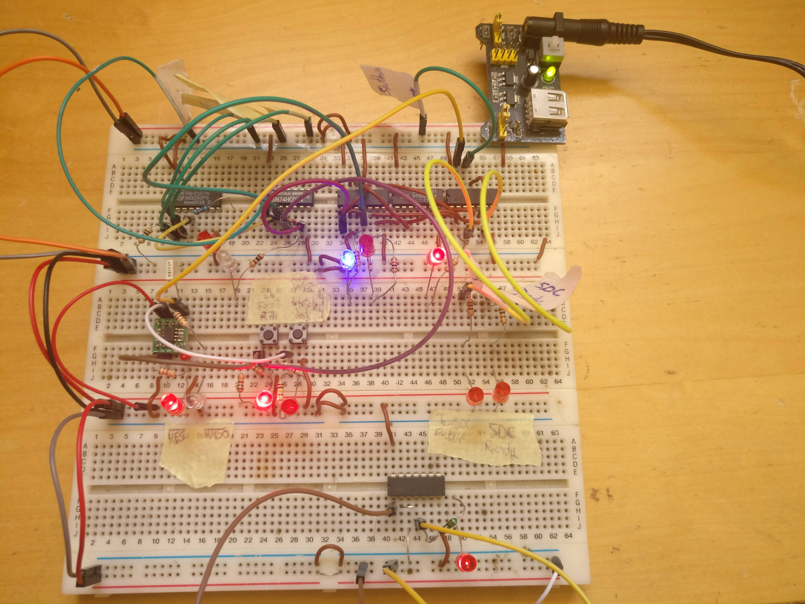

# Emergency Brake System

*Subsystem of [Driverless Kart](kart.md).*

**2020 - 2022**

<video width="100%" controls muted playsinline>
  <source src="../videos/safety-switch.mp4" type="video/mp4">
</video>

*Safety switch closeup on the kart.*

## Overview

Safety-critical emergency braking system designed for autonomous racing vehicles. The EBS provides fail-safe stopping capability independent of the main brake system, ensuring vehicle safety in emergency situations.

## Key Features

- **Fail-safe Design** - Independent emergency stopping mechanism
- **STM32 Microcontroller** - Real-time control and monitoring
- **Rapid Response** - Emergency activation in critical situations
- **Integration** - Seamlessly integrates with autonomous vehicle systems

## Technical Details

### Implementation

- Embedded software development for STM32 platform
- Custom electronics and actuation hardware
- Safety protocols and redundancy systems
- Real-time emergency detection and response

### Technologies Used

- STM32 Microcontroller
- C/C++ for embedded systems
- Custom actuator electronics
- CAN bus communication

## Highlights

!!! success "Safety First"
    Designed and implemented a fail-safe emergency brake system for autonomous vehicles, providing critical safety redundancy.

!!! info "Real-time Control"
    Developed embedded software for real-time emergency detection and actuation with sub-millisecond response times.

## Media

<video width="100%" controls>
  <source src="../images/ebs/ebs-demo.mp4" type="video/mp4">
  Your browser does not support the video tag.
</video>

*Demo video of the emergency brake system in action*

## Resources

- [Download Demo Video](../images/ebs/ebs-demo.mp4)

## Context

Developed as part of Formula Student Driverless competition vehicle. Related to the [Driverless Kart](kart.md) project.
