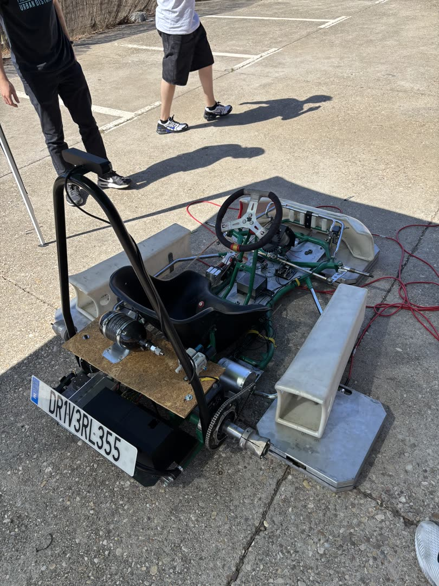
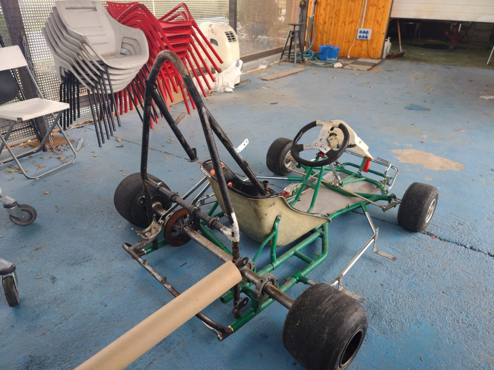
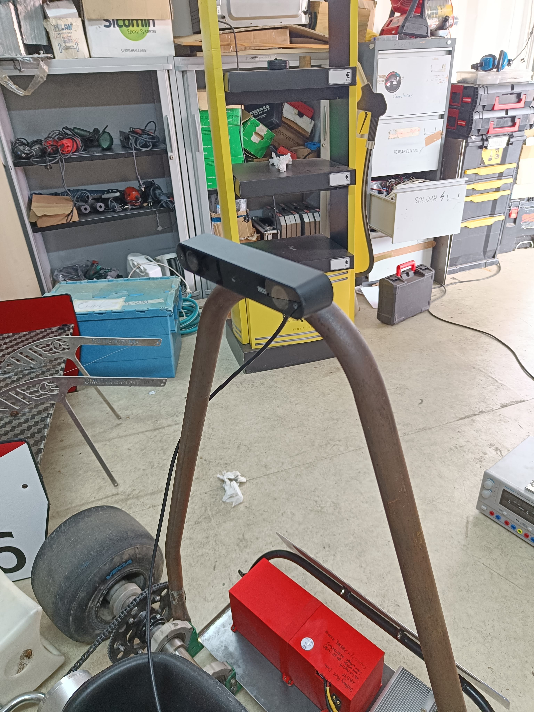
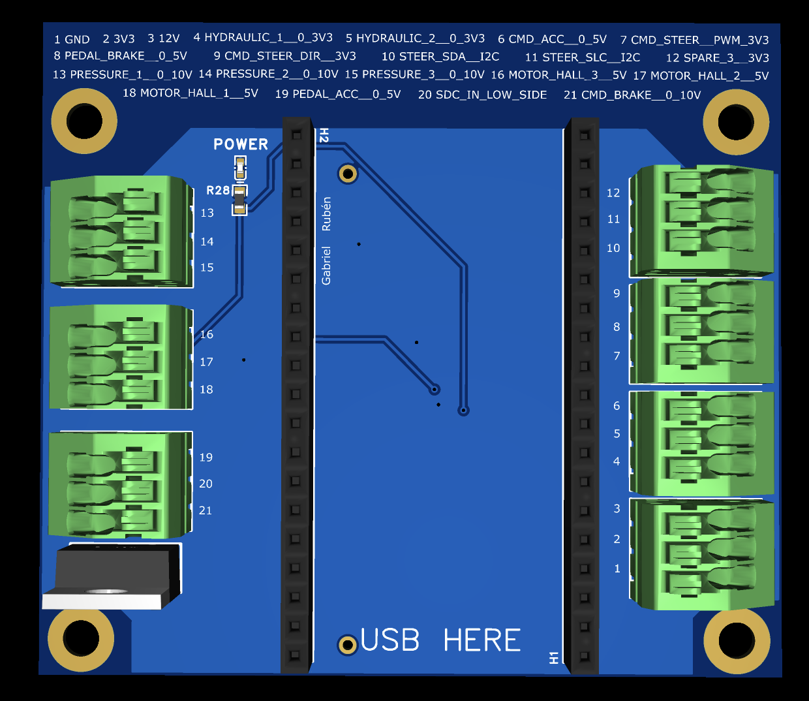
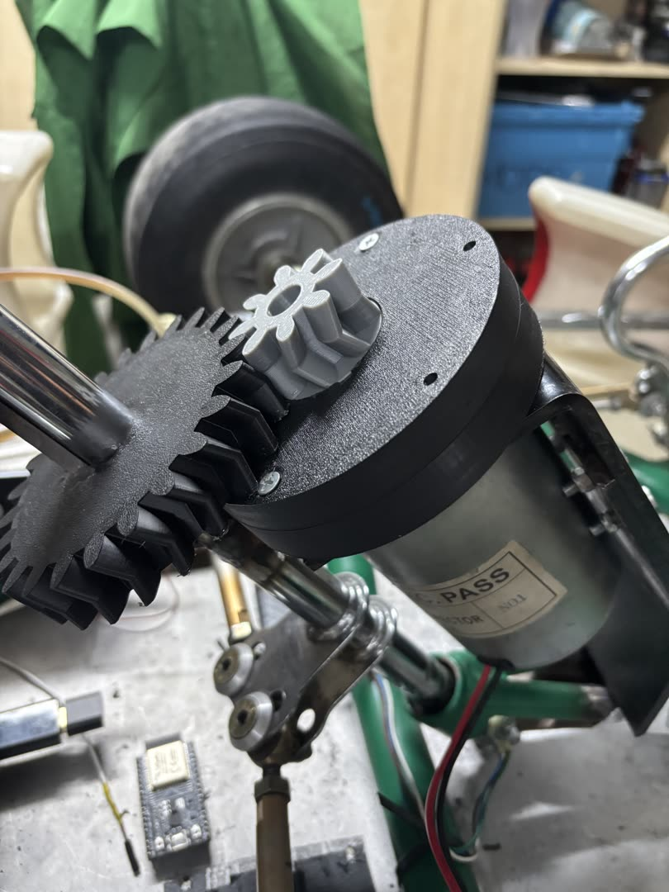
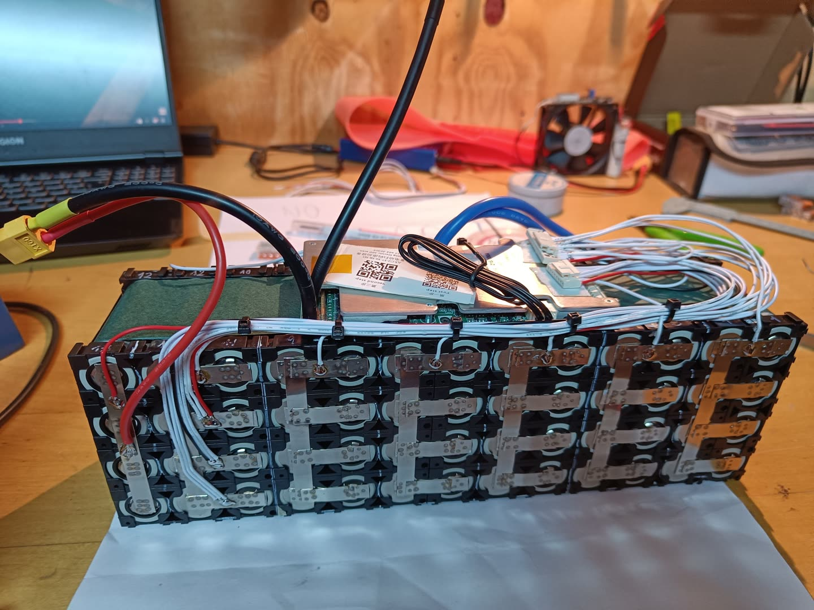

# Driverless Kart

:material-star: **Flagship project** · 2020 – present · Outdoor autonomous vehicle testbed built on a real competition kart.

<video width="100%" controls autoplay muted loop playsinline>
  <source src="../videos/kart-hero.mp4" type="video/mp4">
</video>

📚 [Documentation](https://um-driverless.github.io/kart_docs/) · 💻 [kart-brain (perception + control)](https://github.com/UM-Driverless/kart_brain) · [kart_docs (mechanical/electrical/process)](https://github.com/um-driverless/kart_docs) · [driverless (legacy Python stack)](https://github.com/UM-Driverless/driverless)

!!! success "Status — May 2026"
    ROS 2 migration complete. Manual mode fully operational. **First
    autonomous run completed 5 full laps on a cone-defined track**
    (April 2025) before a printed PLA sun gear in the steering reducer
    snapped on the 6th lap — a known PLA-creep failure with a brass
    upgrade already designed. Autonomous mode actively integrated.

## What it is

A modular autonomous platform built on a real Tony Kart chassis, designed as an **outdoor testbed** for perception, planning, and control algorithms. Maintains manual drive capability so a safety driver can take over at any time, which makes it a practical platform for real-world algorithm validation rather than a simulator-bound demo.

## Hardware

- **Compute** — NVIDIA Jetson AGX Orin (JetPack 6.2.2, CUDA 12.6, 62 GB RAM, Ubuntu 22.04)
- **Perception sensor** — ZED 2 stereo camera (USB 3.0, GPU-accelerated depth)
- **Microcontroller** — ESP32 "Kart Medulla" custom PCB, FreeRTOS, UART link to the Orin at 115200 baud
- **Steering actuation** — DC motor + planetary reducer (in-house design; see [Steering](steering.md))
- **Emergency brake** — fail-safe pneumatic system on STM32 (see [EBS](ebs.md))
- **Wheel sensorisation** — custom PCB for hall-effect odometry (see [Wheel Sensor](wheel-sensor.md))
- **Frame** — 2024 Tony Kart competition chassis
- **Power** — custom 18650 lithium pack with JBD BMS, spot-welded in-house

## Software architecture

Everything from cone perception to steering commands runs in **ROS 2 Humble** on the Orin. The ESP32 is the safety boundary: if the high-level loop dies, the kart fails into a known mechanical-safe state independent of the Linux side.

- **Perception** — YOLOv5 cone detector + stereo depth localiser. 3D cone positions published to ROS 2 in real time on the Jetson's GPU.
- **Control** — geometric / pure-pursuit controllers. Each controller publishes its picked target point to `/kart/target`; the dashboard HUD subscribes to the same topic, so what the user sees and what the controller commands cannot disagree.
- **Pre-ROS legacy stack** — earlier 100% Python pipeline ran at ~50 Hz end-to-end on the same hardware. [Walkthrough video](https://youtu.be/wZSFr2eYE4M?si=JckY54OkSBQb4r1M).

<video width="100%" controls muted playsinline>
  <source src="../videos/autonomous-cones.mp4" type="video/mp4">
</video>

*Autonomous mode running outdoors on a cone course.*

## Engineering decisions worth a closer look

These are the kind of choices that don't appear on a CV bullet point but actually drive whether the system works.

**Steering sun-gear: nylon → brass.** The planetary reducer's nylon sun gear kept failing at the motor shaft's D-flat — not by tooth shear, but by the bore plastically deforming around the flat under repeated direction reversals (nylon creep on impulsive load). Software mitigations slow the failure but can't prevent it; the root cause is the material/geometry pairing. Decision: machine the sun in brass, keep planets and ring nylon. Wear migrates from the highest-duty part (sun) to the easily-replaced spur planets, and the failure mode shifts from sudden total loss to gradual audible backlash growth — a graceful degradation upgrade.

**Pure-pursuit HUD/wheel mismatch.** Bug report: dashboard arrow pointed right, wheel turned left. The instinct was to chase a sign error in the controller; the architectural fix was different. The HUD and the controller had been computing the target *independently from the same inputs*, so any small divergence (filtering, frame timing) would surface as a confusing mismatch. Refactor: each controller now publishes its picked aim point on `/kart/target`, and the HUD subscribes to that topic. The arrow can no longer disagree with what the controller commanded — the redundancy was the bug.

**Dashboard offline access on a moving kart.** Pit shop WiFi drops the moment the kart rolls outdoors, and the team had been opening the dashboard via phone hotspot through the public Cloudflare URL — which silently routed the data through the cell network for a 2-metre link. Decision: use the Orin's LAN URL when on hotspot (phones speak L2 to the Orin, no cellular round-trip), with an ⓘ popover in the dashboard exposing the live LAN IP so nobody has to memorise it. Cloudflare URL stays as a from-anywhere backup. Avoided the alternative (USB AP dongle on the Orin) until field experience justifies the hardware.

**Branch protection after a self-merge incident.** A teammate merged their own PR straight into `main`. Root cause was that the GitHub org's *Base permissions* defaulted to Admin, which made every branch-protection rule a polite suggestion. Fix: org base permission dropped to Write, branch-protection set to require 1 review, and the offending commit was preserved on `dev` while reverting `main` rather than force-rewriting history. Process and tooling, not blame.

## Subsystems

- **[Emergency Brake System (EBS)](ebs.md)** — fail-safe pneumatic stop on STM32 with sub-millisecond detection.
- **[Steering](steering.md)** — actuator, planetary reducer, control integration, and the brass-sun upgrade above.
- **[Wheel Sensor](wheel-sensor.md)** — custom hall-effect PCB for odometry, schematic-to-assembly in-house.
- **[Electronics](electronics.md)** — system-level integration: harness, power distribution, sensor and actuator wiring.

## Gallery

- { loading=lazy }
- { loading=lazy }
- { loading=lazy }
- { loading=lazy }
- { loading=lazy }
- { loading=lazy }

## Links

- **[kart-brain](https://github.com/UM-Driverless/kart_brain)** — Jetson-side perception, control, ROS 2 nodes
- **[kart_docs](https://github.com/um-driverless/kart_docs)** — mechanical, electrical, hydraulics, BOM
- **[driverless (legacy)](https://github.com/UM-Driverless/driverless)** — pre-ROS Python stack, ~50 Hz reference
- **[How Our Autonomous Kart Software Works](https://youtu.be/wZSFr2eYE4M?si=JckY54OkSBQb4r1M)** — walkthrough video of the legacy stack
