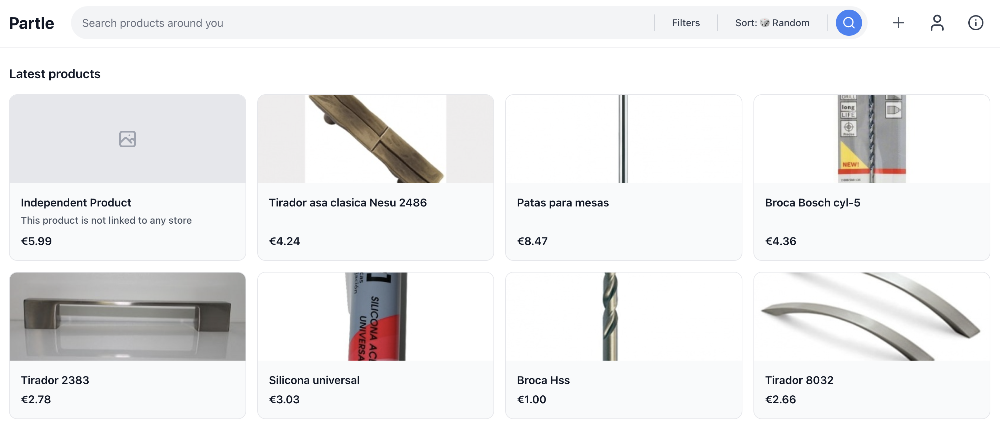

# Partle - Local Product Search Engine

**May 2025 - Present**

[Visit Partle](https://partle.rubenayla.xyz/){ .md-button .md-button--primary } [API Docs](https://partle.rubenayla.xyz/docs){ .md-button }

## Overview

A search engine for finding hardware and DIY products in physical stores near you. Born from the frustration of spending 40 minutes driving between stores looking for a specific door lock — only to find them closed or out of stock.

Partle aggregates product data from stores across Spain and Switzerland (15,000+ stores, 2,400+ products) so you can search once and see what's available nearby. It's built for urgency: when you need a specific part *today*, not in 2 days via Amazon.

## Key Features

- **Product search** across thousands of physical stores, sorted by distance or price
- **Store pages** with location, product inventory, and links to the store's website
- **Server-side rendering** for SEO — product, store, and user pages are fully crawlable with JSON-LD structured data
- **MCP server** so AI assistants (Claude, etc.) can search products directly
- **Google OAuth + password auth** with account linking
- **Product image pipeline** — scrapers download images, served via nginx with Cloudflare edge caching
- **Community features** — users can add products, write reviews, rate items

## Architecture

**Frontend:** Next.js App Router (TypeScript), Tailwind CSS, Radix UI, Leaflet maps. Migrated from Vite SPA to Next.js for SSR and SEO.

**Backend:** FastAPI (Python 3.12+), PostgreSQL, SQLAlchemy, Alembic migrations. Full-text search with English stemming and prefix matching.

**Scraping:** Scrapy spiders for store websites (Bauhaus, Decathlon, Conrad, etc.). Playwright + Camoufox for JS-heavy sites with anti-bot protection.

**Infrastructure:** Hetzner Cloud (cx22, 5 EUR/month), nginx reverse proxy, Cloudflare DNS + CDN. Standalone Next.js + uvicorn behind nginx.

**AI integration:** Remote MCP server at `/mcp/` (Streamable HTTP), public API at `/v1/public/*`, `/.well-known/mcp.json` discovery, Schema.org JSON-LD, sitemaps with IndexNow.

## Technical Highlights

- SSR pages (`/p/`, `/s/`, `/u/`) with `generateMetadata` and JSON-LD for Google rich results
- Product images stored on filesystem, served by nginx, cached at Cloudflare edge
- Scraper infrastructure handles anti-bot measures (Camoufox anti-detect browser, brotli workarounds)
- 96% of stores have geolocation data for distance-based sorting
- Public no-auth API endpoints for AI agent consumption (rate-limited 100/hr per IP)

## Resources

- [Live site](https://partle.rubenayla.xyz/)
- [API documentation](https://partle.rubenayla.xyz/docs)
- [MCP server](https://github.com/rubenayla/partle-mcp) (public repo)
