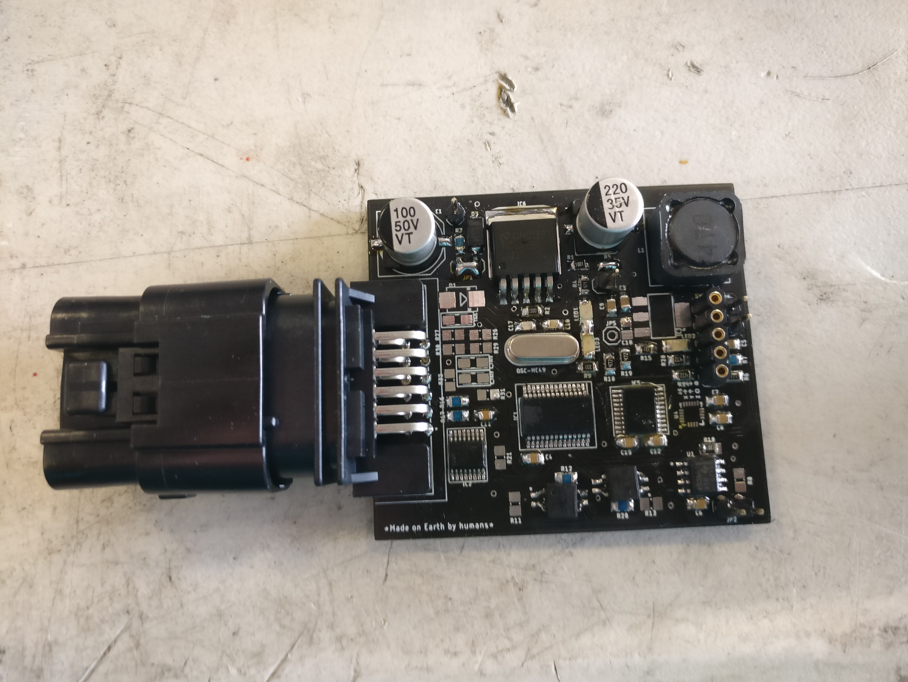
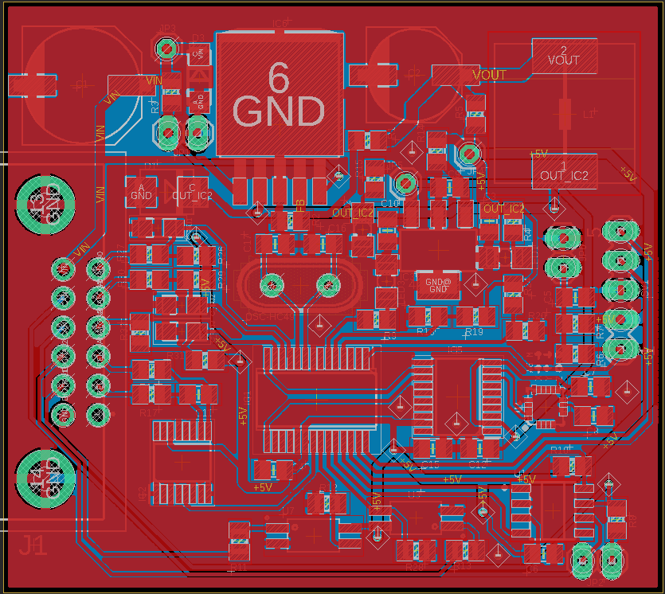

# Wheel Sensorization Module

**2020 - 2022**

## Overview

Custom electronics module for wheel speed sensing, odometry, and vehicle positioning. Provides critical sensor data for autonomous navigation and control systems.

## Key Features

- **Custom PCB Design** - Purpose-built electronics for wheel sensing (SENv_03)
- **Odometry & Positioning** - Accurate vehicle state estimation
- **Compact Integration** - Fits within wheel hub assembly
- **Real-time Data** - High-frequency sensor readings for control loops

## Technical Details

### Implementation

- Complete PCB design and layout from schematic to manufacturing
- Sensor fusion algorithms for accurate odometry
- Signal conditioning and processing circuits
- CAN bus communication interface for vehicle network

### Technologies Used

- PCB Design (KiCAD/Altium)
- Embedded C programming
- Sensor fusion algorithms
- CAN protocol implementation

## Highlights

!!! success "Complete Hardware Design"
    Designed and manufactured custom PCB from concept to production, including schematic, layout, and assembly.

!!! info "Precision Sensing"
    Implemented sensor fusion for accurate odometry, critical for autonomous vehicle positioning and control.

## Resources

**Project Documentation:**

- [Design Release Presentation](../files/wheel-sensor-design-release.pptx) - Complete design review and technical specifications
- [Technical Documentation](../files/wheel-sensor-documentation.docx) - Detailed implementation documentation
- [Project Approval Presentation](../files/wheel-sensor-project-approval.pptx) - Project proposal and system overview

## Context

Developed for Formula Student competition vehicles. Part of the vehicle state estimation system for autonomous racing. Related to the [Driverless Kart](kart.md) project.
